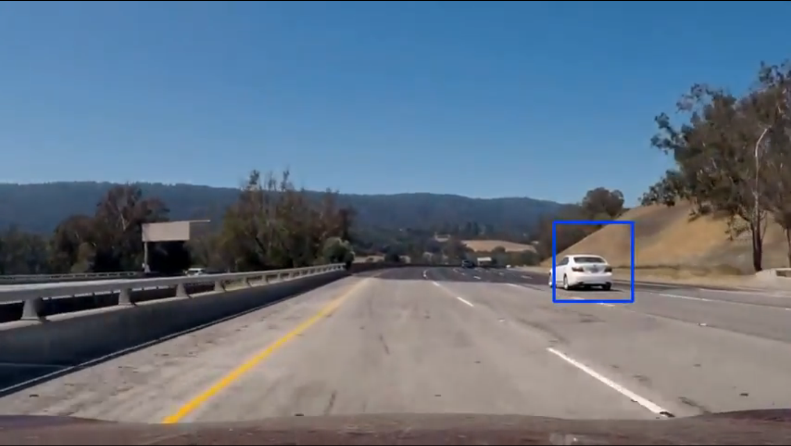

# Vehicle Detection

In this project, your goal is to write a software pipeline to detect vehicles in a video (start with the test_video.mp4 and later implement on full project_video.mp4), but the main output or product we want you to create is a detailed writeup of the project.
The Project
---

The goals / steps of this project are the following:

* Perform a Histogram of Oriented Gradients (HOG) feature extraction on a labeled training set of images and train a classifier Linear SVM classifier
* Optionally, you can also apply a color transform and append binned color features, as well as histograms of color, to your HOG feature vector. 
* Note: for those first two steps don't forget to normalize your features and randomize a selection for training and testing.
* Implement a sliding-window technique and use your trained classifier to search for vehicles in images.
* Run your pipeline on a video stream (start with the test_video.mp4 and later implement on full project_video.mp4) and create a heat map of recurring detections frame by frame to reject outliers and follow detected vehicles.
* Estimate a bounding box for vehicles detected.

[//]: # (Image References)

[image1]: ./output_images/data_set.png "dataset" 
[image2]: ./output_images/hog_history.png "hog_history"
[image3]: ./output_images/hog.png "hog"
[image4]: ./output_images/final_single.png "final_single"
[image5]: ./output_images/YUV_29.12.png "YUV29.12"
[image6]: ./output_images/Video.png "Video"
[image7]: ./output_images/Transformation.png "warp-TransformationImage"
[image8]: ./output_images/warped_lines.jpg "warped lines"
[image9]: ./output_images/warped_img.png "warped Image"
[image10]: ./output_images/finding_lines.png "finding lines"
[image11]: ./output_images/final_infos.png "Flipped Image"
[image12]: ./output_images/sobel.png "sobel"
[image13]: ./output_images/dir.png "dir Image"
[image14]: ./output_images/s_channel.png "Flipped Image"

### Inspecting the Training Data

First of all I read in the Training images and combined all Car images and Non-Car images. That gave me a dataset of 8792 Car images and 8968 Non-Car images.

![image1]

### Extracting HOG-Features

Next step was to extract the hog features of the images and train the support vector machine.

![image3]

You can find the whole training pipeline in Hog_classifier.ipynb and the training history is saved in Hog_log.csv.
Here is an overview of the results for the trained parameters.

![image2]

My final SVM had an ACC of 99.68% and was trained with the following parameters:
- cell_per_block:2 	
- color space: YCrCb 	
- hog channels: ALL 	 
- orient: 11
- pix_per_cell: 16   
However it was just trained on the hog features and without spatial binning features or color histogram features! (space for improvement)
 
I saved the final parameters, the X_scaler and the SVM in a pickle document.

## Image Processing Pipeline

![image4]

In the final pipeline the cars get detect through the find_cars function. 
Its applied by a window search method, were the region of interest (y-coordinates) are defined in the multi_scale function. After detecting cars in the image a heat_map is applied to store multiple detections and to verify the correct area of the car in the image. To overcome false positives a threshold function is set in to delete hot areas in the image with wrong detections that are under the threshold-detection-count. 
Finally the hot areas get labeled by the draw_labeled_bboxes function and boxes are drawn by draw_boxes.
 

Outputs of the test images:
![image5]

## Pipeline on video:

For processing videos I applied a Bboxes_Detection()-class that stores in previous detection to smooth heat_map detections over several frames.

##### Final Video: 

### Discussion:
- I noticed that overall the svm does not detect as much as supposed to therefor I try to implement spatial binning and color hist.
- speed of my pipeline is improvable 
- noticed two short false positives (could be fixed by more detections of the cars and a followed higher threshold)

